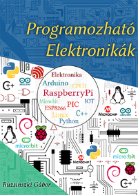

https://www.webmaster442.hu/letoltheto-irasok/programozhato-elektronikak/

Programozható Elektronikák kód melléklet
=====================

Ezen repository a Programozható elektronikák könyv letölthetõ melléklete. Itt a könyvhöz kapcsolódó dokumentumok, forráskódok szerepelnek.

A melléklet letölthetõ az oldalt megtalálható "Download ZIP" menüponttal egyszerûen ZIP formátumban.

#Jogi információk

A forráskódra a BSD Licenc megkötései vonatkoznak. A licenc szövege (a fordítás csak tájékoztató jellegû, és jogi szempontból csakis az angol tekinthetõ mérvadónak):

Copyright (c) 2012-2015, Ruzsinszki Gábor
Minden jog fenntartva.

A forrás és bináris formában való újraterjesztés és használat, módosításokkal vagy anélkül is engedélyezett, feltéve hogy a következõ feltételek teljesülnek:
1. A forráskód újraterjesztésénél kötelezõ alkalmazni a fenti copyright felhívást, az itt található feltételeket és a következõkben olvasható korlátozott felelõsségi nyilatkozatot.
2. A bináris formában való újraterjesztés esetén a binárishoz adott dokumentációban és/vagy egyéb anyagban kötelezõ idézni a fenti copyright felhívást, az itt található feltételeket és a következõkben olvasható korlátozott felelõsségi nyilatkozatot.
3. Minden hirdetési anyag, mely e szoftver tulajdonságait említi vagy hasznosságára mutat, a következõ tudósítást fel kell tüntesse: Ez a termék a(z) Ruzsinszki Gábor által fejlesztett szoftvert tartalmaz.
4. Elõzetes, kimondottan a célra szóló írásos engedély nélkül se Ruzsinszi Gábor neve, se a neki közremûködõk nevei nem használhatók arra hogy védjeggyel lássák el, vagy jobb színben tüntessék fel azt a terméket, mely ebbõl a szoftverbõl származik.

EZT A SZOFTVERT Ruzsinszki Gábor "AHOGY VAN" SZOLGÁLTATJA ÉS MINDEN NYÍLT VAGY BURKOLT GARANCIAJOGOT VISSZAUTASÍT VELE KAPCSOLATBAN - BELEÉRTVE DE NEM KIZÁRÓLAGOSAN KORLÁTOZVA AZ ELADHATÓSÁGRA, VAGY EGY ADOTT CÉLRA VALÓ ALKALMAZHATÓSÁGRA VONATKOZÓ GARANCIÁT. Ruzsinszki Gábor NEM VONHATÓ SEMMILYEN SZINTÛ FELELÕSSÉGRE -, MELYET AKÁR SZERZÕDÉSBEN RENDEZETT, VAGY SZERZÕDÉSEN KÍVÜLI FELELÕSSÉGVISZONY ALAPJÁN ÁLLAPÍTANÁNAK MEG (BELEÉRTVE A HANYAGSÁG VAGY MÁS MIATT KIALAKULÓ VISZONYT IS), SEMMILYEN A SZOFTVER HASZNÁLATÁBÓL EREDÕ ESEMÉNY KAPCSÁN MELY KÖZVETLEN, KÖZVETETT, VÉLETLENSZERÛ, KÜLÖNLEGES, PÉLDÁTLAN VAGY SZÜKSÉGSZERÛEN BEKÖVETKEZÕ KÁRHOZ VEZET (BELEÉRTVE A KÁROK KÖZÉ DE NEM KIZÁRÓLAGOSAN KORLÁTOZVA AZT A HELYETTESÍTÕ TERMÉKEK VAGY SZOLGÁLTATÁSOK BESZERZÉSÉRE, ÜZEMKIESÉSRE, ADATVESZTÉSRE, ELMARADT HASZONRA, VAGY ÜZLETMENET MEGSZAKADÁSÁRA) MÉG AKKOR SEM HA A KÁROSODÁS LEHETÕSÉGE ELÕRE LÁTHATÓ VOLT.

#Mappák & Fájlok listája:

- Kodok
  A Különbözõ projektek forráskódjai.
- Rajzok
  A könyvben szereplõ kapcsolási rajzok EAGLE formátumban. A rajzok elnevezései nem azonossak a könyv beli ábra számmal.
- Eagle Konyvtar
  A saját Eagle könyvtáram, néhány olyan elemmel, ami nincs meg más könyvtárakban.

#Arduino könyvtárak

A könyvben számos Arduino könyvtár szerepel. Ezek különbözõ címekrõl tölthetõek le. A saját munkám megkönnyítése érdekében létrehoztam egy GitHub repository-t a könyvtárak könnyû beszerzésére. Ez a repository a https://github.com/webmaster442/ArduinoExtensions címen lelhetõ fel.